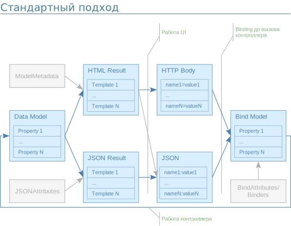
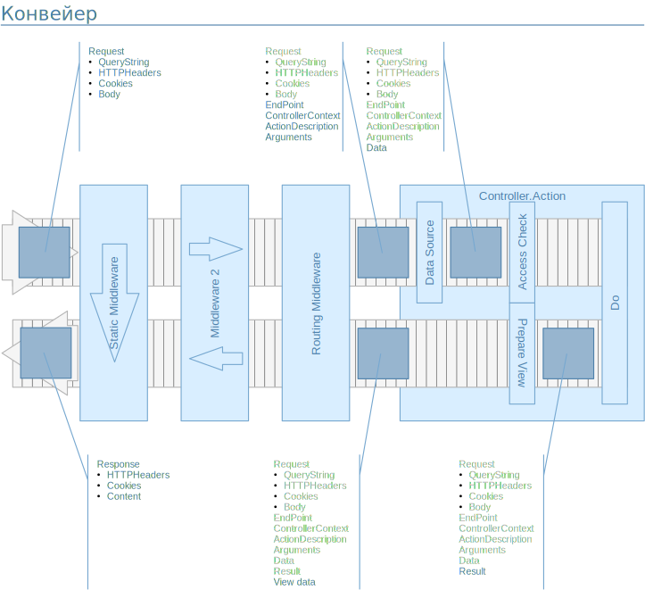

# Как обычно работают в .NET MVC с формами

Давайте посмотрим на стандартный подход к показу и обновлению данных:



Первым делом мы каким-либо образом в контроллере получили модель данных и наша цель - показать пользователю данные этой модели и, скорее всего, сохранить изменения пользователя.

В случае простого UI имеет смысл сразу отправить модель в Razor шаблон для генерации HTML, более сложные случаи могут требовать сохранения данных в JSON для использования в VueJS/React/т.п. компонентах. Для генерации HTML у нас есть несколько возможностей:
1. Сделать все нужное в шаблоне т.е. учесть видимость свойств, их доступность для редактирования.
1. Использовать ModelMetadata, зарегистрировав своего провайдера и/или используя атрибуты на свойствах
1. Использовать ViewBag для передачи нужных для генерации HTML данных
1. Сделать ViewModel, куда переложить данные и уже именно эту модель отправить на генерацию HTML

С серелизацией в JSON все проще:
1. Есть атрибуты для описания что и как должно быть серелизовано
1. Можно так же сделать объект, куда переложить данные, нужные на интерфейсе и уже его серелизовать.

Полученный HTML или JSON уходит пользователю и что происходит там нас пока не сильно интересует, но результатом у нас будет или application/formdata или text/json в теле HTTP запроса, на основе которых нам нужно изменить данные. Данные запроса нужно разложить по известным свойствам, проверить и отправить на сохранение.
Обычно напрямую данные в модель данных не отправляют, а создают модель куда .NET разложит/десерелизует данные из запроса, выполнит проверки и откуда данные будут перекладываться в модель данных и отправляться на сохранение.

Существует множество примеров и статей как это сделать, так же этот процесс заложен в шаблоны для MVC проектов.

Однако в реальной жизни есть много неудобных моментов, которые стоит рассмотреть подробнее. И начнем с шаблонов.

## Шаблоны для моделей

В разных руководствах и статьях предлагается для каждого действия контроллера делать свое View, которе можно поместить в контейнер, указав свойство Layout, что избавляет от необходимости в каждом шаблоне повторять весь "окружающий" HTML. Для отдельных свойств нужно использовать специальные шаблоны, например с контролом для редактирования дат или текста ну или переиспользовать шаблоны через RenderPartial с передачей в них части отображаемой модели.

В таком подходе нас поджидает 2 проблемы:
1. Передача информации о том, как именно нужно отобразить то или иное свойство
1. Огромное количество вью и вспомогательных классов.

Первую проблему обычно предлагают решать через атрибуты на свойствах, например Required или Readonly, которые с помощью ModelMetadata попадают в шаблон и на основе этой информации происходит отображение свойств, но в случае сложных систем это не работает, особенно если информация об отображении свойств зависит от множества факторов: этапа бизнес-процесса, прав пользователя, данных в других свойствах. И это не полный перечень, реально он может быть любым, все зависит от задачи. Особенно странно видеть атрибуты Readonly в модели данных, которые Readonly могут быть только на интерфейсе пользователя. Конечно можно передавать всю необходимую информацию во ViewBag или ModelMetadata, но ViewBag не типизирован, данные, положенные в ModelMetadata контроллеров в шаблоне не видны т.к. там создается свой экземпляр ModelMetadata и заполнять его нужно в ModelMetadataProvider. Совсем все сложно становится когда добавляется вложенность моделей данных друг в друга.

Вторая проблема кажется попроще, но когда в проектах тысячи шаблонов и нужно сделать изменение дизайна или унифицировать интерфейс это приводит к огромным временным затратам и снижению качества, что отрицательно сказывается на проекте в целом.

## Binding и перенос данных в модель

Раскладка данных из запроса происходит благодаря магии с использованием ModelMetadata. Очень удобно написать 
```csharp
public IActionResult Update(Guid id, [FromBody] MyModel model)
{
    ...Проверка наличия ошибок Binding и обновление модели данных...
}
```
и получить готовую модель, однако и здесь есть ряд проблем
1. Передача информации о том, что нужно положить в модель, а что нет
1. Раскладка данных и валидация происходят до выполнения действия контроллера и никак не контролируется (ну почти никак)
1. Можно сделать свой Binder, но для принятия решения о раскладке данных могут потребоваться дополнительные данные, которые не так просто получить
1. Механизм просматривает все свойства объекта, а не только те, что есть в запросе
1. Для валидации могут понадобится данные, которых нет в запросе

Все, что выходит за рамки стандартных атрибутов опять же нужно реализовывать на уровне ModelMetadataProvider или IValidatableObject, но тут ожидает большая проблема: модель для раскладки данных из запроса должна по структуре соответствовать модели данных, но отличаться атрибутами и/или валидацией. Получается на каждую модель данных, которая отображается и изменяется на интерфейсе нужно делать свою модель для раскладки данных запроса, теоретически ничего не мешает эту модель использовать и для генерации HTML т.е. сделать такую цепочку:

> DataModel -> RenderBindModel -> Razor -> HTTP Body -> RenderBindModel -> DataModel

и тогда часть проблем уйдет т.к. логика частично переедет в ModelMetadataProvider а часть в Binder.

## Повторное использование отображения

Есть RenderPartial и RenderAction и все кажется вполне неплохо, пока не возникает необходимость встраивать шаблоны в другие части сайта и тут начинают мешаться права, обработчики и ограничения, настроенные на методах контроллера в случае использования RenderAction, невозможность поменять генерацию ссылок и встроить что-то свое в RenderPartial. А еще в случае RenderAction будет задействован весь механизм от роутинга до запуска результата что часто мешает.

## Удобство поддержки и развития кода

Из-за всех вышеуказанных проблем мы имеем:
- Распыление кода между ModelMetadataProvider, Binder, Razor шаблонами что приводит к сложности отладки и понимания того, как все это вместе должно работать
- Большое количество дополнительных шаблонов и классов, куда нужно вносить изменения при изменении основной модели данных что увеличивает трудоемкость внесения изменений
- При необходимости раскладки и валидации данных из других типов источников нужно реализовывать свой механизм для запуска раскладки и валидации с использованием уже сделанных ModelMetadataProvider и Binder или делать отдельную реализацию, что опять приводит к увеличению трудоемкости доработок
- Для тестов нужно инициализировать всю инфраструктуру, включая настройку роутинга.

Если реализовывать небольшие или узкоспециализированные проекты, то скорее всего эти проблемы либо незаметны либо не сильно критичны, но становятся головной болью в крупных проектах и в проектах со сложными процессами. Так же приходится регулярно сталкиваться с ленью разработчиков, которые стремятся минимизировать трудоемкость и использовать, например, модель данных так же для раскладки или начинают писать мега шаблон для отображения любой модели данных на основе атрибутов.

## Что со всем этим делать

Для решения возникающих проблем для начала нужно сформировать требования, которые помогут упростить жизнь разработчикам без ущерба возможностям реализации бизнес-требований. Собственно их получается не так много:

1. Все должно быть под контролем, магия в больших проектах - зло
1. Правильная реализация должна быть самым простым путем, которым может идти разработчик
1. Минимальный overhead кода
1. Подход должен максимально соответствовать технологиям .NET MVC и понятен при начале работы с ним
1. Для сложных случаев должна быть предусмотрена понятная стратегия усложнения реализации

По сути нам нужно построить конвейер обработки запроса и он должен быть у нас под контролем.

Начало конвейера - вызов метода контроллера т.к. все до этого момента можно рассматривать как поиск того, что будет обрабатывать запрос. Да, от точки когда запрос приходит в приложение до вызова метода контроллера работает много чего:
- Настроенные Middleware для выполнения разных функций от отдачи статического контента до сбора статистики о обработки исключений.
- Роутинг, который в итоге и приведет нас к вызову метода контроллера и который тоже является одним из настроенных Middleware
- Механизм, определяющий нужный контроллер и инициализирующий его
- Механизм поиска метода контроллера и его вызова с требуемыми параметрами, полученными из запроса

Все это будем считать "черным ящиком", куда поступает запрос и приводит к вызову нужного метода, наша цель - разобраться с контроллером и шаблонами.

Внутри контроллера наш конвейер должен иметь следующие этапы:
1. По параметрам определить и получить необходимые для работы данные
1. Проверить права пользователя и доступность выполнения действия в текущем состоянии данных, определить правила и ограничения работы с данными
1. Выполнить нужные действия
1. Настроить и подготовить информацию для отображения
1. Передать все подготовленное в шаблон или серелизатор

Выход из конвейера - отправка результата пользователю.

Исходя из того, что модель данных у нас построена исходя из бизнес-требований и она должна быть свободна от информации для шаблонов и раскладки данных трогать мы ее не можем, но можем поработать над тем, что отправляется в шаблоны и используется для раскладки данных и в идеале эта должна быть некая структура, которая во-первых не должна повторять модель данных для минимизации overhead кода, но должна аккумулировать все необходимое для шаблонов и раскладки данных.

Для шаблона необходима модель с информацией что должно отображаться и в каком виде, назовем это ViewModel, а для раскладки данных информация о том, что и как разложить в модель данных - BindModel. Но тут очень часто разработчики допускают крайне неприятную ошибку: уделяют внимание отображению данных, но забывают про проверки при раскладке данных и получается крайне неприятно, когда продвинутый пользователь меняет то, что теоретически менять не должен. Таким образом настройка ViewModel и BindModel должна в идеале совпадать и происходить один раз и тут можно сделать только одно - объединить ViewModel и BindModel, что закроет нам большую часть проблем.

## Итого

- Делаем модель, которая будет в себе аккумулировать информацию об отображении свойств модели данных, видимости и доступности для изменения
- Только такую модель передаем в шаблоны
- Только эту модель используем для раскладки данных
- Не используем ModelMetadata т.к. наша модель по сути заменяет этот механизм
- Раскладка данных происходит только внутри метода контроллера
- Валидация должна быть разделена на :
    - Валидацию соответствия типам данных
    - Валидацию с использованием данных из модели данных с учетом бизнес-процессов, прав и т.п. 
    - Валидацию в рамках бизнес-процесса (да, кажется что это повторяет предыдущий пункт, но тут все сложнее и будет подробно описано позже)
- Все это - конвейер, который можно пройти под отладкой по шагам и где все этапы явно видны и понятно что там используется.

---
Вот мы и добрались до реализации, приступим к нашей [FormModel](#doc:formModel).
